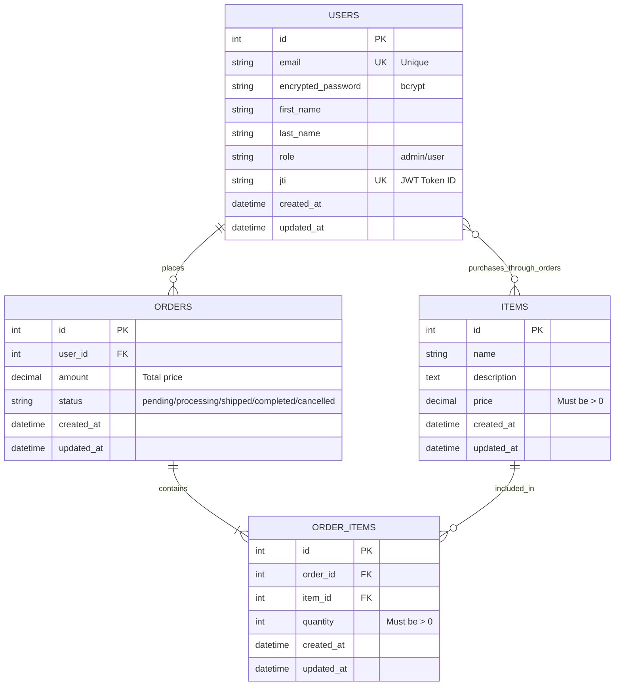

# ER-диаграмма базы данных (Entity-Relationship Diagram)

## Интерактивная диаграмма (Mermaid)



## Визуальная схема (ASCII)

```
┌─────────────────────────────────────────────────────────────────────┐
│                         DATABASE SCHEMA                              │
└─────────────────────────────────────────────────────────────────────┘

┌──────────────────────────┐
│         USERS            │
├──────────────────────────┤
│ PK │ id                  │ INTEGER
│    │ email               │ STRING (UNIQUE, NOT NULL)
│    │ encrypted_password  │ STRING (NOT NULL)
│    │ first_name          │ STRING (NOT NULL)
│    │ last_name           │ STRING (NOT NULL)
│    │ role                │ STRING (DEFAULT: 'user')
│    │                     │   VALUES: ['admin', 'user']
│    │ jti                 │ STRING (UNIQUE, NOT NULL)
│    │                     │   JWT Token Identifier
│    │ reset_password_token│ STRING (UNIQUE)
│    │ reset_password_sent_at │ DATETIME
│    │ remember_created_at │ DATETIME
│    │ created_at          │ DATETIME (NOT NULL)
│    │ updated_at          │ DATETIME (NOT NULL)
└──────────┬───────────────┘
           │
           │ 1:N
           │
           ▼
┌──────────────────────────┐
│        ORDERS            │
├──────────────────────────┤
│ PK │ id                  │ INTEGER
│ FK │ user_id             │ INTEGER (NOT NULL)
│    │ amount              │ DECIMAL(10,2) (NOT NULL)
│    │                     │   Общая сумма заказа
│    │ status              │ STRING (DEFAULT: 'pending')
│    │                     │   VALUES: ['pending', 'processing', 
│    │                     │            'shipped', 'completed', 'cancelled']
│    │ created_at          │ DATETIME (NOT NULL)
│    │ updated_at          │ DATETIME (NOT NULL)
└──────────┬───────────────┘
           │
           │ 1:N
           │
           ▼
┌──────────────────────────┐        ┌──────────────────────────┐
│     ORDER_ITEMS          │   N:1  │         ITEMS            │
├──────────────────────────┤◄───────├──────────────────────────┤
│ PK │ id                  │ INTEGER│ PK │ id                  │ INTEGER
│ FK │ order_id            │ INTEGER│    │ name                │ STRING (NOT NULL)
│ FK │ item_id             │ INTEGER│    │ description         │ TEXT
│    │ quantity            │ INTEGER│    │ price               │ DECIMAL(10,2) (NOT NULL)
│    │                     │ (DEFAULT: 1, NOT NULL)             │ created_at          │ DATETIME (NOT NULL)
│    │ created_at          │ DATETIME (NOT NULL)                │ updated_at          │ DATETIME (NOT NULL)
│    │ updated_at          │ DATETIME (NOT NULL)                └──────────────────────────┘
└──────────────────────────┘


═══════════════════════════════════════════════════════════════════════
                            RELATIONSHIPS
═══════════════════════════════════════════════════════════════════════

1. USERS ──< ORDERS (One-to-Many)
   • Один пользователь может иметь много заказов
   • Каждый заказ принадлежит одному пользователю
   • Cascade: ON DELETE CASCADE (удаление user удаляет его orders)

2. ORDERS ──< ORDER_ITEMS (One-to-Many)
   • Один заказ содержит много позиций товаров
   • Каждая позиция принадлежит одному заказу
   • Cascade: ON DELETE CASCADE (удаление order удаляет order_items)

3. ITEMS ──< ORDER_ITEMS (One-to-Many)
   • Один товар может быть в многих заказах
   • Каждая позиция заказа ссылается на один товар
   • Cascade: ON DELETE RESTRICT (нельзя удалить товар из заказа)

4. USERS >──< ITEMS (Many-to-Many through ORDERS)
   • Пользователь связан с товарами через свои заказы
   • Реализовано через промежуточные таблицы ORDERS и ORDER_ITEMS
   • Позволяет отследить историю покупок пользователя


═══════════════════════════════════════════════════════════════════════
                            INDEXES
═══════════════════════════════════════════════════════════════════════

USERS:
  • PRIMARY KEY: id
  • UNIQUE INDEX: email
  • UNIQUE INDEX: reset_password_token
  • UNIQUE INDEX: jti

ITEMS:
  • PRIMARY KEY: id
  • INDEX: name (для поиска)

ORDERS:
  • PRIMARY KEY: id
  • FOREIGN KEY INDEX: user_id → users(id)
  • COMPOSITE INDEX: (user_id, created_at) для быстрой выборки заказов пользователя
  • INDEX: status для фильтрации по статусу заказа

ORDER_ITEMS:
  • PRIMARY KEY: id
  • FOREIGN KEY INDEX: order_id → orders(id)
  • FOREIGN KEY INDEX: item_id → items(id)
  • UNIQUE COMPOSITE INDEX: (order_id, item_id) - один товар один раз в заказе


═══════════════════════════════════════════════════════════════════════
                        CONSTRAINTS
═══════════════════════════════════════════════════════════════════════

USERS:
  • email: FORMAT validation (email regex)
  • password: MIN LENGTH 6 characters
  • role: ENUM ['admin', 'user']
  • first_name: MIN LENGTH 2, MAX LENGTH 50
  • last_name: MIN LENGTH 2, MAX LENGTH 50

ITEMS:
  • name: MIN LENGTH 2, MAX LENGTH 200
  • price: GREATER THAN 0
  • description: MAX LENGTH 2000

ORDERS:
  • amount: GREATER THAN 0
  • user_id: MUST EXIST in users table
  • status: ENUM ['pending', 'processing', 'shipped', 'completed', 'cancelled']
  • status: DEFAULT 'pending'

ORDER_ITEMS:
  • quantity: INTEGER, GREATER THAN 0
  • order_id: MUST EXIST in orders table
  • item_id: MUST EXIST in items table
  • UNIQUE (order_id, item_id)


═══════════════════════════════════════════════════════════════════════
                    BUSINESS LOGIC
═══════════════════════════════════════════════════════════════════════

1. Расчет суммы заказа (Order.amount):
   amount = SUM(order_items.quantity × items.price)
   • Вычисляется автоматически при создании заказа
   • Обновляется при изменении order_items
   • Не зависит от статуса заказа (сумма фиксируется при создании)

2. Подсчет товаров в заказе (Order.items_count):
   items_count = SUM(order_items.quantity)

3. Подсчет подытога позиции (OrderItem.subtotal):
   subtotal = quantity × item.price

4. Статус заказа (Order.status):
   Lifecycle: pending → processing → shipped → completed
              └─────────────────┴──────────> cancelled
   
   • pending: Заказ создан, ожидает обработки
   • processing: Заказ в обработке
   • shipped: Заказ отправлен
   • completed: Заказ выполнен и получен
   • cancelled: Заказ отменен
   
   Правила:
   • Новый заказ всегда создается со статусом 'pending'
   • Только заказы со статусом 'completed' учитываются в статистике продаж
   • Отмененные заказы (cancelled) не влияют на inventory


═══════════════════════════════════════════════════════════════════════
                    EXAMPLE DATA
═══════════════════════════════════════════════════════════════════════

USERS:
┌────┬───────────────────┬────────────┬───────────┬────────┐
│ id │ email             │ first_name │ last_name │ role   │
├────┼───────────────────┼────────────┼───────────┼────────┤
│ 1  │ admin@example.com │ Admin      │ User      │ admin  │
│ 2  │ user@example.com  │ John       │ Doe       │ user   │
└────┴───────────────────┴────────────┴───────────┴────────┘

ITEMS:
┌────┬─────────────────────┬──────────────────────────────┬─────────┐
│ id │ name                │ description                  │ price   │
├────┼─────────────────────┼──────────────────────────────┼─────────┤
│ 1  │ Laptop Dell XPS 13  │ Powerful ultrabook...        │ 1299.99 │
│ 2  │ iPhone 15 Pro       │ Latest Apple smartphone...   │ 999.99  │
│ 3  │ Sony WH-1000XM5     │ Premium noise-canceling...   │ 399.99  │
└────┴─────────────────────┴──────────────────────────────┴─────────┘

ORDERS:
┌────┬─────────┬──────────┬────────────┬─────────────────────┐
│ id │ user_id │ amount   │ status     │ created_at          │
├────┼─────────┼──────────┼────────────┼─────────────────────┤
│ 1  │ 2       │ 2699.97  │ completed  │ 2024-02-12 10:30:00 │
│ 2  │ 2       │ 1299.99  │ processing │ 2024-02-13 14:20:00 │
└────┴─────────┴──────────┴────────────┴─────────────────────┘

ORDER_ITEMS:
┌────┬──────────┬─────────┬──────────┐
│ id │ order_id │ item_id │ quantity │
├────┼──────────┼─────────┼──────────┤
│ 1  │ 1        │ 1       │ 2        │  (2 × 1299.99 = 2599.98)
│ 2  │ 1        │ 3       │ 1        │  (1 × 399.99  = 399.99)
└────┴──────────┴─────────┴──────────┘
                            Total: 2999.97


═══════════════════════════════════════════════════════════════════════
                    SQL MIGRATIONS
═══════════════════════════════════════════════════════════════════════

Миграции находятся в: backend/db/migrate/

1. 20240101000001_devise_create_users.rb
   • Создает таблицу users
   • Настраивает Devise
   • Добавляет кастомные поля (first_name, last_name, role)

2. 20240101000002_create_items.rb
   • Создает таблицу items

3. 20240101000003_create_orders.rb
   • Создает таблицу orders
   • Связывает с users

4. 20240101000004_create_order_items.rb
   • Создает таблицу order_items
   • Связывает с orders и items
   • Устанавливает ограничения


═══════════════════════════════════════════════════════════════════════
                    DATABASE MANAGEMENT
═══════════════════════════════════════════════════════════════════════

Создание БД:
  rails db:create

Применение миграций:
  rails db:migrate

Откат последней миграции:
  rails db:rollback

Заполнение тестовыми данными:
  rails db:seed

Полный сброс и пересоздание:
  rails db:drop db:create db:migrate db:seed

Просмотр схемы:
  rails db:schema:dump
  cat db/schema.rb


═══════════════════════════════════════════════════════════════════════
                    ADVANCED FEATURES
═══════════════════════════════════════════════════════════════════════

## Soft Delete (Рекомендация для продакшена)

Для сохранения целостности исторических данных рекомендуется использовать
логическое удаление (soft delete) вместо физического удаления товаров.

### Расширение таблицы ITEMS:

```sql
ALTER TABLE items ADD COLUMN deleted_at TIMESTAMP;
CREATE INDEX index_items_on_deleted_at ON items(deleted_at);
```

### Изменения в схеме:

```
ITEMS (с soft delete):
├─ deleted_at          │ DATETIME (NULL)
└─ Scope: default_scope { where(deleted_at: nil) }
```

### Преимущества:
• Старые заказы не ломаются при "удалении" товара
• Возможность восстановления данных
• Аудит и история изменений
• Соответствие требованиям регуляторов (GDPR, SOX)

### Реализация в модели:

```ruby
class Item < ApplicationRecord
  acts_as_paranoid  # gem 'paranoia'
  # или
  default_scope { where(deleted_at: nil) }
  
  def soft_delete
    update(deleted_at: Time.current)
  end
end
```

